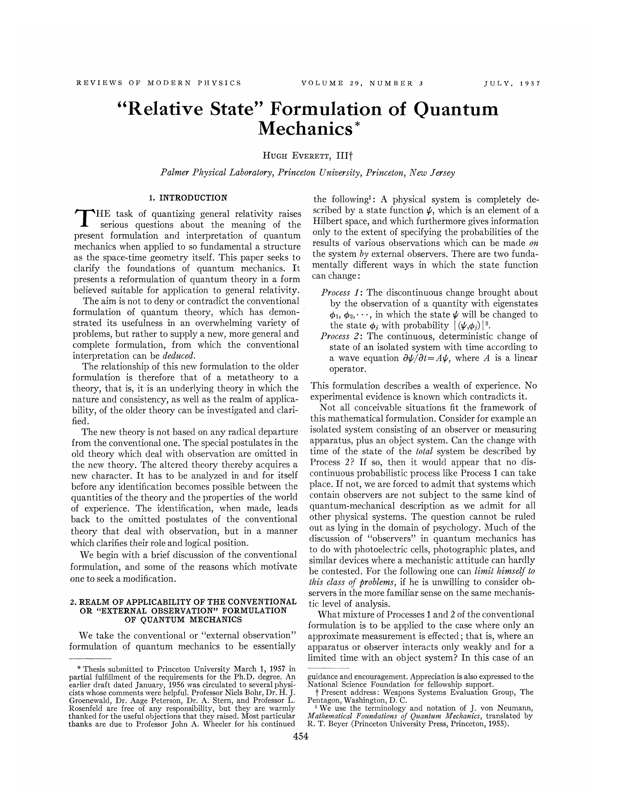
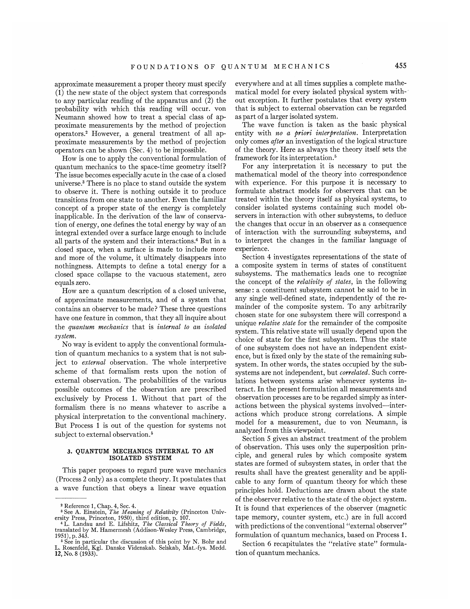
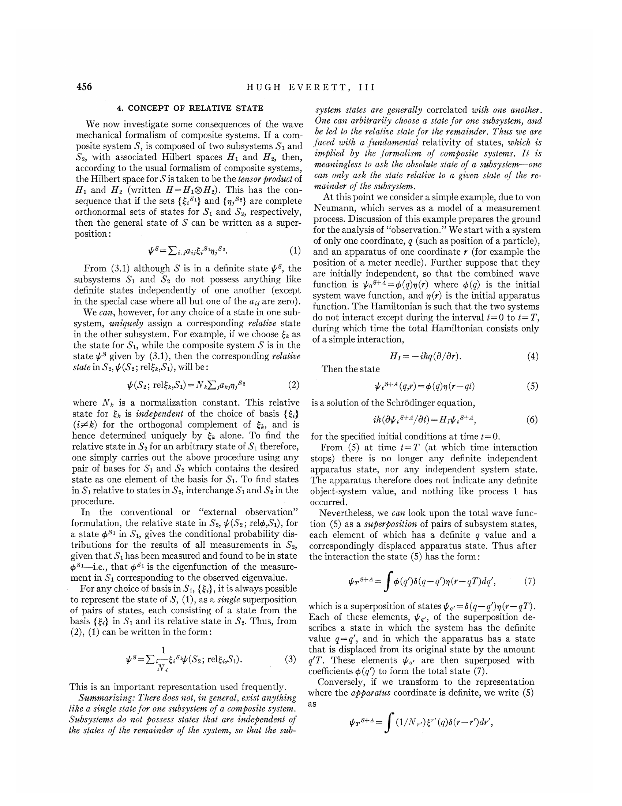
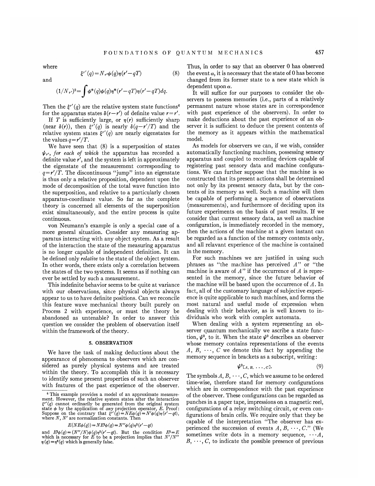
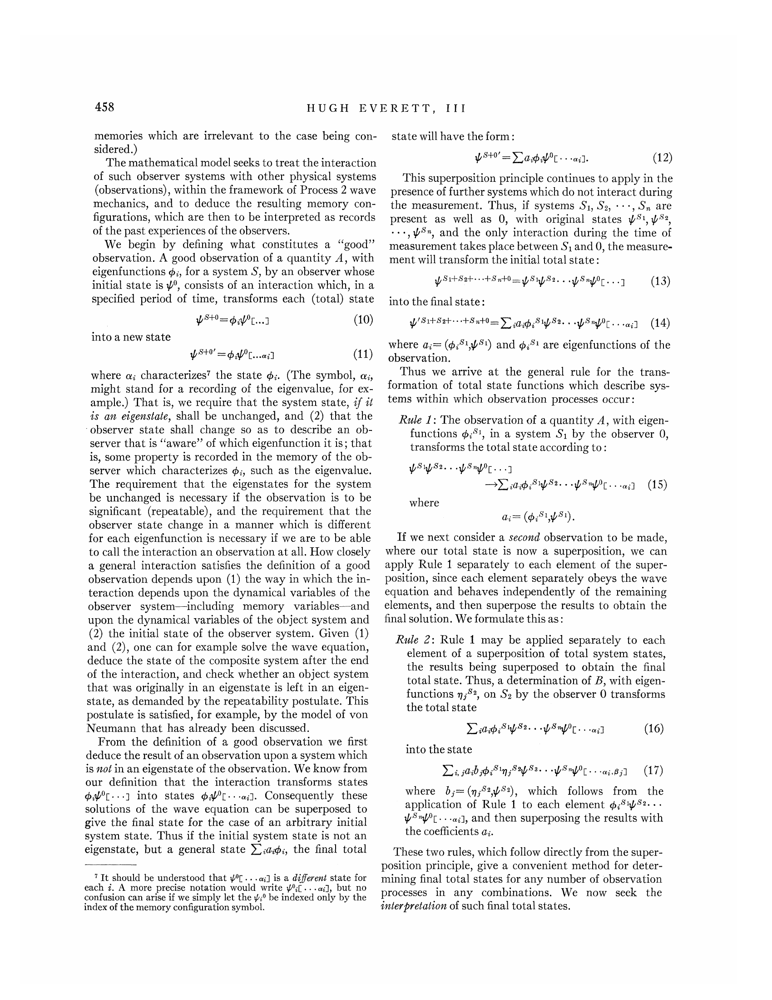
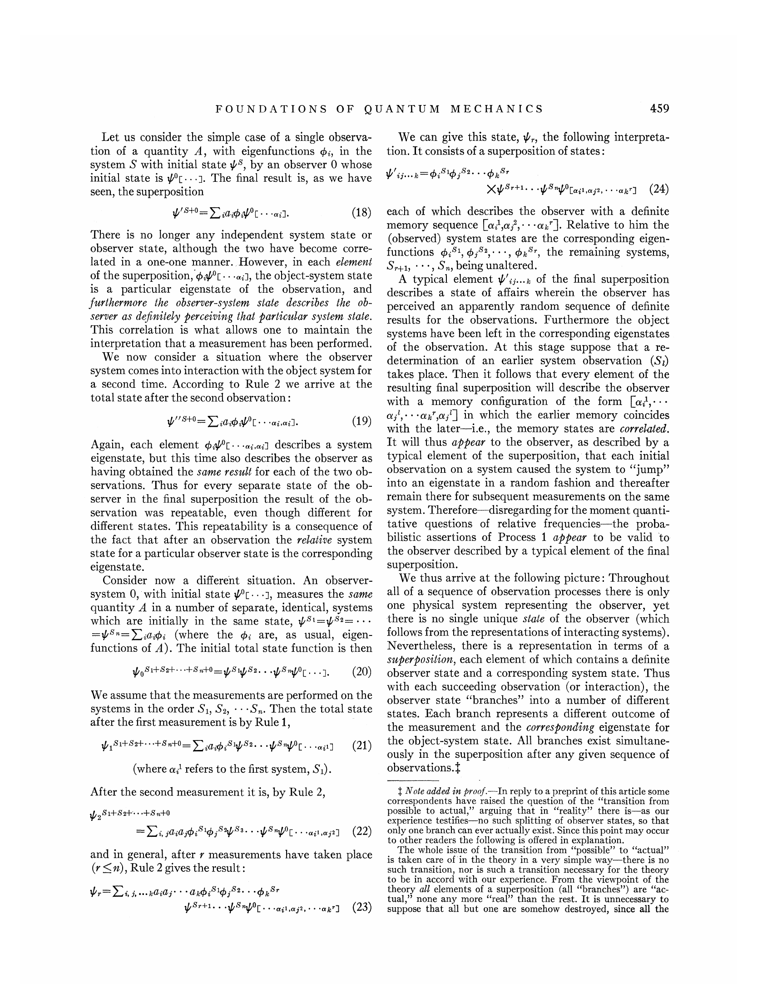
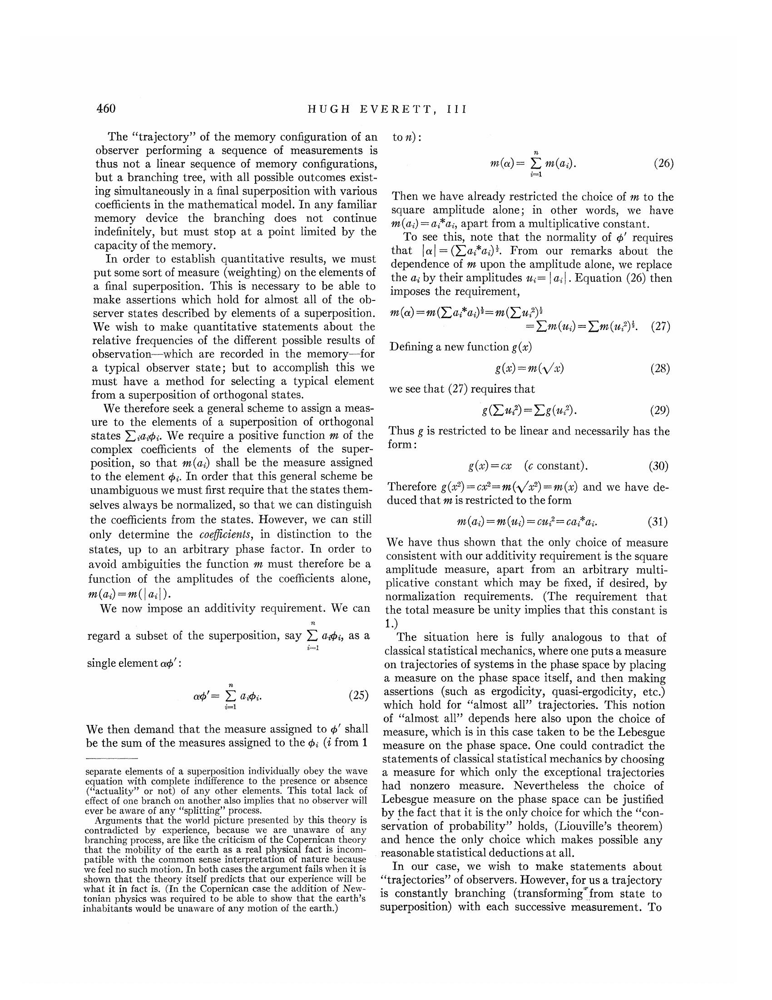
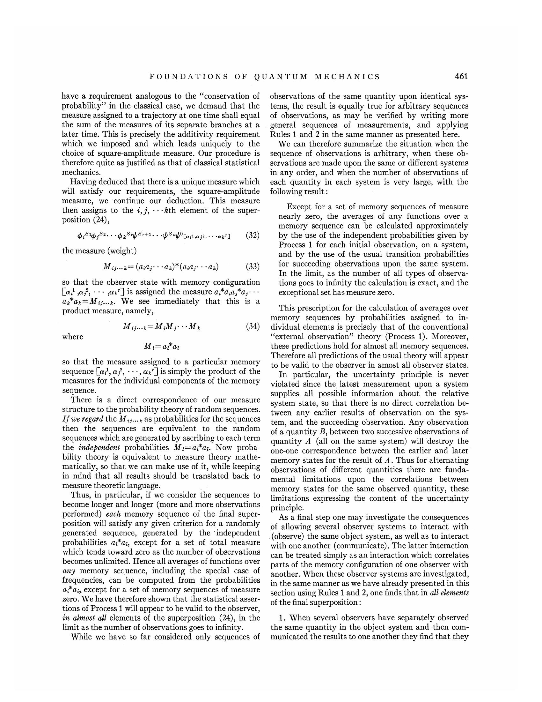
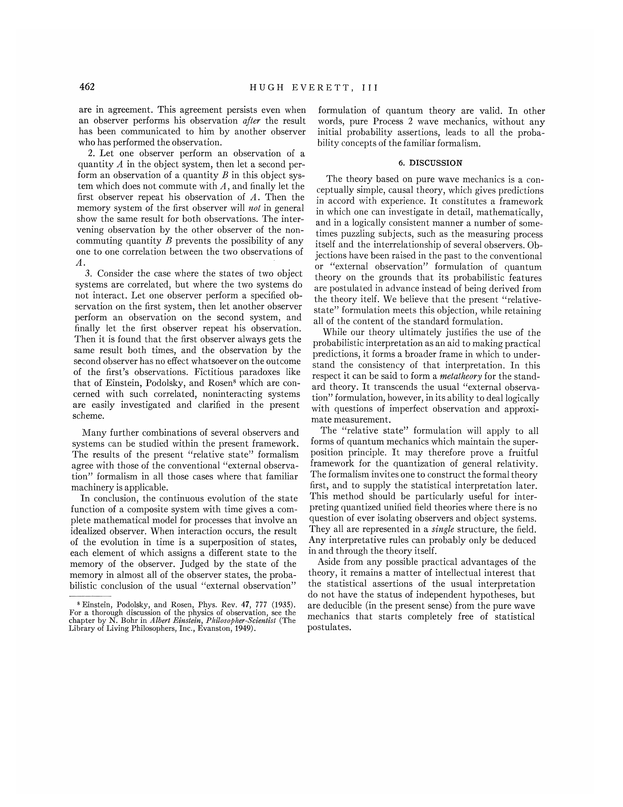

# “Relative State” Formulation of Quantum Mechanics

**Author:** Hugh Everett, III  
**Publication:** Reviews of Modern Physics, Vol. 29, No. 3, July 1957  
**Original PDF:** `everett-1957.pdf`

> OCR-generated Markdown from the original PDF. The page images below preserve the original layout and typography; verify equations and special symbols against the page images when precision matters.

## Page images

- [Page 1](images/page-001.png)
- [Page 2](images/page-002.png)
- [Page 3](images/page-003.png)
- [Page 4](images/page-004.png)
- [Page 5](images/page-005.png)
- [Page 6](images/page-006.png)
- [Page 7](images/page-007.png)
- [Page 8](images/page-008.png)
- [Page 9](images/page-009.png)

---

## Page 1

### OCR text

REVIEWS OF MODERN PHYSICS

VOLUME 29,

NUMBER 3 JULY, 1957

“Relative State” Formulation of Quantum
Mechanics*

Hugh Everett, III†

Palmer Physical Laboratory, Princeton University, Princeton, New Jersey

1, INTRODUCTION

HE task of quantizing general relativity raises
serious questions about the meaning of the
present formulation and interpretation of quantum
mechanics when applied to so fundamental a structure
as the space-time geometry itself. This paper seeks to
clarify the foundations of quantum mechanics. It
presents a reformulation of quantum theory in a form
believed suitable for application to general relativity.
The aim is not to deny or contradict the conventional
formulation of quantum theory, which has demon-
strated its usefulness in an overwhelming variety of
problems, but rather to supply a new, more general and
complete formulation, from which the conventional
interpretation can be deduced.

The relationship of this new formulation to the older
formulation is therefore that of a metatheory to a
theory, that is, it is an underlying theory in which the
nature and consistency, as well as the realm of applica-
bility, of the older theory can be investigated and clari-
fied.

The new theory is not based on any radical departure
from the conventional one. The special postulates in the
old theory which deal with observation are omitted in
the new theory. The altered theory thereby acquires a
new character. It has to be analyzed in and for itself
before any identification becomes possible between the
quantities of the theory and the properties of the world
of experience. The identification, when made, leads
back to the omitted postulates of the conventional
theory that deal with observation, but in a manner
which clarifies their role and logical position.

We begin with a brief discussion of the conventional
formulation, and some of the reasons which motivate
one to seek a modification.

2, REALM OF APPLICABILITY OF THE CONVENTIONAL
OR “EXTERNAL OBSERVATION” FORMULATION
OF QUANTUM MECHANICS

We take the conventional or “external observation”
formulation of quantum mechanics to be essentially

* Thesis submitted to Princeton University March 1, 1957 in
partial fulfillment of the requirements for the Ph.D.. degree. An
earlier draft dated January, 1956 was circulated to several physi-
cists whose comments were helpful. Professor Niels Bohr, Dr. H. J.
Groenewald, Dr. Aage Peterson, Dr. A. Stern, and Professor L.
Rosenfeld are free of any responsibility, but they are warmly
thanked for the useful objections that they raised. Most particular
thanks are due to Professor John A. Wheeler for his continued

the following!: A physical system is completely de-
scribed by a state function y, which is an element of a
Hilbert space, and which furthermore gives information
only to the extent of specifying the probabilities of the
results of various observations which can be made on
the system by external observers. There are two funda-
mentally different ways in which the state function
can change:

Process 1: The discontinuous change brought about
by the observation of a quantity with eigenstates
1, $2,°**, in which the state y will be changed to
the state $; with probability | (¥,¢,) |?

Process 2: The continuous, deterministic change of
state of an isolated system with time according to
a wave equation 0~/dt= Ay, where A is a linear
operator.

This formulation describes a wealth of experience. No
experimental evidence is known which contradicts it.

Not all conceivable situations fit the framework of
this mathematical formulation. Consider for example an
isolated system consisting of an observer or measuring
apparatus, plus an object system. Can the change with
time of the state of the total system be described by
Process 2? If so, then it would appear that no dis-
continuous probabilistic process like Process 1 can take
place. If not, we are forced to admit that systems which
contain observers are not subject to the same kind of
quantum-mechanical description as we admit for all
other physical systems. The question cannot be ruled
out as lying in the domain of psychology. Much of the
discussion of “observers” in quantum mechanics has
to do with photoelectric cells, photographic plates, and
similar devices where a mechanistic attitude can hardly
be contested. For the following one can limit himself to
this class of problems, if he is unwilling to consider ob-
servers in the more familiar sense on the same mechanis-
tic level of analysis.

What mixture of Processes 1 and 2 of the conventional
formulation is to be applied to the case where only an
approximate measurement is effected; that is, where an
apparatus or observer interacts only weakly and for a
limited time with an object system? In this case of an

guidance and encouragement. Appreciation is also expressed to the
National Science Foundation for fellowship support.

{ Present address: Weapons Systems Evaluation Group, The
Pentagon, Washington, D. C.

1 We use the terminology and notation of J. von Neumann,
Mathematical Foundations of Quantum Mechanics, translated by
R. T. Beyer (Princeton University Press, Princeton, 1955).

454

---

## Page 2

### OCR text

FOUNDATIONS OF QUANTUM MECHANICS

approximate measurement a proper theory must specify
(1) the new state of the object system that corresponds
to any particular reading of the apparatus and (2) the
probability with which this reading will occur. von
Neumann showed how to treat a special class of ap-
proximate measurements by the method of projection
operators.? However, a general treatment of all ap-
proximate measurements by the method of projection
operators can be shown (Sec. 4) to be impossible.

How is one to apply the conventional formulation of
quantum mechanics to the space-time geometry itself?
The issue becomes especially acute in the case of a closed
universe.’ There is no place to stand outside the system
to observe it. There is nothing outside it to produce
transitions from one state to another. Even the familiar
concept of a proper state of the energy is completely
inapplicable. In the derivation of the law of conserva-
tion of energy, one defines the total energy by way of an
integral extended over a surface large enough to include
all parts of the system and their interactions.‘ But in a
closed space, when a surface is made to include more
and more of the volume, it ultimately disappears into
nothingness. Attempts to define a total energy for a
closed space collapse to the vacuous statement, zero
equals zero.

How are a quantum description of a closed universe,
of approximate measurements, and of a system that
contains an observer to be made? These three questions
have one feature in common, that they all inquire about
the quantum mechanics that is internal to an isolated
system.

No way is evident to apply the conventional formula-
tion of quantum mechanics to a system that is not sub-
ject to external observation. The whole interpretive
scheme of that formalism rests upon the notion of
external observation. The probabilities of the various
possible outcomes of the observation are prescribed
exclusively by Process 1. Without that part of the
formalism there is no means whatever to ascribe a
physical interpretation to the conventional machinery.
But Process 1 is out of the question for systems not
subject to external observation.®

3. QUANTUM MECHANICS INTERNAL TO AN
ISOLATED SYSTEM

This paper proposes to regard pure wave mechanics
(Process 2 only) as a complete theory. It postulates that
a wave function that obeys a linear wave equation

? Reference 1, Chap. 4, Sec. 4.

%See A. Einstein, The Meaning of Relativity (Princeton Univ-
ersity Press, Princeton, 1950), third edition, p. 107.

4L. Landau and E. Lifshitz, The Classical Theory of Fields,
translated by M. Hamermesh (Addison-Wesley Press, Cambridge,
1951), p. 343.

5 See in particular the discussion of this point by N. Bohr and
L. Rosenfeld, Kgl. Danske Videnskab. Selskab, Mat.-fys. Medd.
12, No. 8 (1933).

455

everywhere and at all times supplies a complete mathe-
matical model for every isolated physical system with-
out exception. It further postulates that every system
that is subject to external observation can be regarded
as part of a larger isolated system.

The wave function is taken as the basic physical
entity with no a@ priori interpretation. Interpretation
only comes after an investigation of the logical structure
of the theory. Here as always the theory itself sets the
framework for its interpretation.®

For any interpretation it is necessary to put the
mathematical model of the theory into correspondence
with experience. For this purpose it is necessary to
formulate abstract models for observers that can be
treated within the theory itself as physical systems, to
consider isolated systems containing such model ob-
servers in interaction with other subsystems, to deduce
the changes that occur in an observer as a consequence
of interaction with the surrounding subsystems, and
to interpret the changes in the familiar language of
experience.

Section 4 investigates representations of the state of
a composite system in terms of states of constituent
subsystems. The mathematics leads one to recognize
the concept of the relativity of states, in the following
sense: a constituent subsystem cannot be said to be in
any single well-defined state, independently of the re-
mainder of the composite system. To any arbitrarily
chosen state for one subsystem there will correspond a
unique relative state for the remainder of the composite
system. This relative state will usually depend upon the
choice of state for the first subsystem. Thus the state
of one subsystem does not have an independent exist-
ence, but is fixed only by the state of the remaining sub-
system. In other words, the states occupied by the sub-
systems are not independent, but correlated. Such corre-
lations between systems arise whenever systems in-
teract. In the present formulation all measurements and
observation processes are to be regarded simply as inter-
actions between the physical systems involved—inter-
actions which produce strong correlations. A simple
model for a measurement, due to von Neumann, is
analyzed from this viewpoint.

Section 5 gives an abstract treatment of the problem
of observation. This uses only the superposition prin-
ciple, and general rules by which composite system
states are formed of subsystem states, in order that the
results shall have the greatest generality and be appli-
cable to any form of quantum theory for which these
principles hold. Deductions are drawn about the state
of the observer relative to the state of the object system.
It is found that experiences of the observer (magnetic
tape memory, counter system, etc.) are in full accord
with predictions of the conventional “‘external observer”
formulation of quantum mechanics, based on Process 1.

Section 6 recapitulates the “relative state” formula-
tion of quantum mechanics.

---

## Page 3

### OCR text

456

4, CONCEPT OF RELATIVE STATE

We now investigate some consequences of the wave
mechanical formalism of composite systems. If a com-
posite system .S, is composed of two subsystems S; and
S2, with associated Hilbert spaces H; and H», then,
according to the usual formalism of composite systems,
the Hilbert space for S is taken to be the tensor product of
Hy, and Hy, (written H=H,@4H:). This has the con-
sequence that if the sets {&;*1} and {1;5*} are complete
orthonormal sets of states for S; and S2, respectively,
then the general state of S' can be written as a super-
position :

PS = Dia, ise. (1)

From (3.1) although S is in a definite state pS, the
subsystems S; and Sz do not possess anything like
definite states independently of one another (except
in the special case where all but one of the a;; are zero).

We can, however, for any choice of a state in one sub-
system, uniquely assign a corresponding relative state
in the other subsystem. For example, if we choose &;, as
the state for 51, while the composite system S is in the
state y* given by (3.1), then the corresponding relative
state in S2, W(S2; relé.)51), will be:

W(S25 relEs Si) = WL sisns? (2)

where NV; is a normalization constant. This relative
state for & is independent of the choice of basis {&}
(ik) for the orthogonal complement of &, and is
hence determined uniquely by & alone. To find the
relative state in S, for an arbitrary state of S; therefore,
one simply carries out the above procedure using any
pair of bases for S; and S; which contains the desired
state as one element of the basis for S;. To find states
in S, relative to states in S2, interchange S; and S> in the
procedure.

In the conventional or “external observation”
formulation, the relative state in S2, ¥(S2; relé,S1), for
a state #5! in Si, gives the conditional probability dis-
tributions for the results of all measurements in So,
given that S; has been measured and found to be in state
¢Si—i.e., that $%! is the eigenfunction of the measure-
ment in 5 corresponding to the observed eigenvalue.

For any choice of basis in S1, {&,}, it is always possible
to represent the state of S, (1), as a single superposition
of pairs of states, each consisting of a state from the
basis {£;} in S1 and its relative state in S:. Thus, from
(2), (1) can be written in the form:

1
VS=T— ES (So; relé,S1). (3)

Ni

This is an important representation used frequently.
Summarizing: There does not, in general, exist anything
like a single state for one subsystem of a composite system.
Subsystems do not possess states that are independent of
the states of the remainder of the system, so that the sub-

HUGH EVERETT,

III

system states are generally correlated with one another.
One can arbitrarily choose a state for one subsystem, and
be led to the relative state for the remainder. Thus we are
faced with a fundamental relativity of states, which is
implied by the formalism of composite systems. It is
meaningless to ask the absolute state of a subsystem—one
can only ask the state relative to a given state of the re-
mainder of the subsystem.

At this point we consider a simple example, due to von
Neumann, which serves as a model of a measurement
process. Discussion of this example prepares the ground
for the analysis of “observation.” We start with a system
of only one coordinate, g (such as position of a particle),
and an apparatus of one coordinate r (for example the
position of a meter needle). Further suppose that they
are initially independent, so that the combined wave
function is ~oSt4=(q)n(r) where $(q) is the initial
system wave function, and 7(r) is the initial apparatus
function. The Hamiltonian is such that the two systems
do not interact except during the interval ‘=0 to ‘=T,
during which time the total Hamiltonian consists only
of a simple interaction,

Hy = —ihq(0/0r). (4)
Then the state
vS*4 (gr) =b(a(r—q) (5)
is a solution of the Schrédinger equation,
th OW S*4/01) =H S*4, (6)

for the specified initial conditions at time ¢=0.

From (5) at time ¢=T (at which time interaction
stops) there is no longer any definite independent
apparatus state, nor any independent system state.
The apparatus therefore does not indicate any definite
object-system value, and nothing like process 1 has
occurred.

Nevertheless, we can look upon the total wave func-
tion (5) as a superposition of pairs of subsystem states,
each element of which has a definite gq value and a
correspondingly displaced apparatus state. Thus after
the interaction the state (5) has the form:

vrsrs— fegneq—anlr—a2 dy, (7)
which is a superposition of states P=8(q—q')n(r—qT).
Each of these elements, ¥,,, of the superposition de-
scribes a state in which the system has the definite
value g=q', and in which the apparatus has a state
that is displaced from its original state by the amount
q'T. These elements y, are then superposed with
coefficients ¢(q’) to form the total state (7).

Conversely, if we transform to the representation
where the apparatus coordinate is definite, we write (5)
as

Yrstan f (/N 8" (Qalr—r)dr',

---

## Page 4

### OCR text

FOUNDATIONS OF QUANTUM MECHANICS

where
&'(Q)=Nvd(q)n(r'— 47) (8)
and

(1/N P= f $*(q)6(q)a* 9’ — QT) u(r’ — qT dq.

Then the £”’(g) are the relative system state functions®
for the apparatus states 6(r—r’) of definite value r=7’.

If T is sufficiently large, or (r) sufficiently sharp
(near 6(r)), then é’(g) is nearly 6(g—7'/T) and the
relative system states £’’(g) are nearly eigenstates for
the values g=r'/T.

We have seen that (8) is a superposition of states
v, for each of which the apparatus has recorded a
definite value 7’, and the system is left in approximately
the eigenstate of the measurement corresponding to
qg=1'/T. The discontinuous “jump” into an eigenstate
is thus only a relative proposition, dependent upon the
mode of decomposition of the total wave function into
the superposition, and relative to a particularly chosen
apparatus-coordinate value. So far as the complete
theory is concerned all elements of the superposition
exist simultaneously, and the entire process is quite
continuous.

von Neumann’s example is only a special case of a
more general situation. Consider any measuring ap-
paratus interacting with any object system. As a result
of the interaction the state of the measuring apparatus
is no longer capable of independent definition. It can
be defined only relative to the state of the object system.
In other words, there exists only a correlation between
the states of the two systems. It seems as if nothing can
ever be settled by such a measurement.

This indefinite behavior seems to be quite at variance
with our observations, since physical objects always
appear to us to have definite positions. Can we reconcile
this feature wave mechanical theory built purely on
Process 2 with experience, or must the theory be
abandoned as untenable? In order to answer this
question we consider the problem of observation itself
within the framework of the theory.

5. OBSERVATION

We have the task of making deductions about the
appearance of phenomena to observers which are con-
sidered as purely physical systems and are treated
within the theory. To accomplish this it is necessary
to identify some present properties of such an observer
with features of the past experience of the observer.

® This example paranes a model of an approximate measure-
ment. However, the relative system states after the interaction
€"(q) cannot ordinarily be generated from the original system
state @ by the application of any projection operator, E. Proof:
Suppose on the contrary that £7” 0 =NEb(g=N'o(qn(r" —¢q),
where NV, N’ are normalization constants. Then

E(NE$(q)) = NE%$(q) = N"b(q)0*@'— a1)
and E¢(g)=(N”/N)¢(q)n?(r'—qt). But the condition =F
which is necessary for E to be a projection implies that N’/N”’
n(q) =n?(q) which is generally false.

457

Thus, in order to say that an observer 0 has observed
the event a, it is necessary that the state of 0 has become
changed from its former state to a new state which is
dependent upon a.

It will suffice for our purposes to consider the ob-
servers to possess memories (i.e., parts of a relatively
permanent nature whose states are in correspondence
with past experience of the observers). In order to
make deductions about the past experience of an ob-
server it is sufficient to deduce the present contents of
the memory as it appears within the mathematical
model.

As models for observers we can, if we wish, consider
automatically functioning machines, possessing sensory
apparatus and coupled to recording devices capable of
registering past sensory data and machine configura-
tions. We can further suppose that the machine is so
constructed that its present actions shall be determined
not only by its present sensory data, but by the con-
tents of its memory as well. Such a machine will then
be capable of performing a sequence of observations
(measurements), and furthermore of deciding upon its
future experiments on the basis of past results. If we
consider that current sensory data, as well as machine
configuration, is immediately recorded in the memory,
then the actions of the machine at a given instant can
be regarded as a function of the memory contents only,
and all relavant experience of the machine is contained
in the memory.

For such machines we are justified in using such
phrases as “the machine has perceived A” or “the
machine is aware of A” if the occurrence of A is repre-
sented in the memory, since the future behavior of
the machine will be based upon the occurrence of A. In
fact, all of the customary language of subjective experi-
ence is quite applicable to such machines, and forms the
most natural and useful mode of expression when
dealing with their behavior, as is well known to in-
dividuals who work with complex automata.

When dealing with a system representing an ob-
server quantum mechanically we ascribe a state func-
tion, ¥°, to it. When the state y° describes an observer
whose memory contains representations of the events
A, B, ---, C we denote this fact by appending the
memory sequence in brackets as a subscript, writing:

VLA, B, +++] (9)

The symbols A, B, - --,C, which we assume to be ordered
time-wise, therefore stand for memory configurations
which are in correspondence with the past experience
of the observer. These configurations can be regarded as
punches in a paper tape, impressions on a magnetic reel,
configurations of a relay switching circuit, or even con-
figurations of brain cells. We require only that they be
capable of the interpretation “The observer has ex-

perienced the succession of events A, B, ---,C.” (We
sometimes write dots in a memory sequence, ---A,
B, ---+,C, to indicate the possible presence of previous

---

## Page 5

### OCR text

458

memories which are irrelevant to the case being con-
sidered.)

The mathematical model seeks to treat the interaction
of such observer systems with other physical systems
(observations), within the framework of Process 2 wave
mechanics, and to deduce the resulting memory con-
figurations, which are then to be interpreted as records
of the past experiences of the observers.

We begin by defining what constitutes a “good”
observation. A good observation of a quantity A, with
eigenfunctions ¢;, for a system S, by an observer whose
initial state is ¥°, consists of an interaction which, in a
specified period of time, transforms each (total) state

VH= bY] (10)
into a new state
P= bP Cra] (11)

where a; characterizes’ the state ¢;. (The symbol, a,
might stand for a recording of the eigenvalue, for ex-
ample.) That is, we require that the system state, if i
is an eigenstate, shall be unchanged, and (2) that the
observer state shall change so as to describe an ob-
server that is “aware” of which eigenfunction it is; that
is, some property is recorded in the memory of the ob-
server which characterizes ¢;, such as the eigenvalue.
The requirement that the eigenstates for the system
be unchanged is necessary if the observation is to be
significant (repeatable), and the requirement that the
observer state change in a manner which is different
for each eigenfunction is necessary if we are to be able
to call the interaction an observation at all. How closely
a general interaction satisfies the definition of a good
observation depends upon (1) the way in which the in-
teraction depends upon the dynamical variables of the
observer system—including memory variables—and
upon the dynamical variables of the object system and
(2) the initial state of the observer system. Given (1)
and (2), one can for example solve the wave equation,
deduce the state of the composite system after the end
of the interaction, and check whether an object system
that was originally in an eigenstate is left in an eigen-
state, as demanded by the repeatability postulate. This
postulate is satisfied, for example, by the model of von
Neumann that has already been discussed.

From the definition of a good observation we first
deduce the result of an observation upon a system which
is not in an eigenstate of the observation. We know from
our definition that the interaction transforms states
o#L---] into states oyYC---«J. Consequently these
solutions of the wave equation can be superposed to
give the final state for the case of an arbitrary initial
system state. Thus if the initial system state is not an
eigenstate, but a general state >> ia, the final total

7Tt should be understood that Y[...a;] is a different state for
each 7. A more precise notation would write Yi[..-ai], but no
confusion can arise if we simply let the ¥;° be indexed only by the
index of the memory configuration symbol.

HUGH EVERETT,

IIT

state will have the form:
YS = Ya C---ail- (12)

This superposition principle continues to apply in the
presence of further systems which do not interact during
the measurement. Thus, if systems S), So, +++, Sn are
present as well as 0, with original states y*1, p*2,
-++, 5s, and the only interaction during the time of
measurement takes place between S, and 0, the measure-
ment will transform the initial total state:

pSttSat-- + Sat0— Sry Sz. . pSnyrr. G04) (13)
into the final state:
P Sit S2t--+Snb0 = S aib Shp Se. 5 pSaprr pog-Fh (14)

where a;= (6:5!,y%") and ¢;%! are eigenfunctions of the
observation.

Thus we arrive at the general rule for the trans-
formation of total state functions which describe sys-
tems within which observation processes occur:

Rule 1: The observation of a quantity A, with eigen-
functions ¢,*!, in a system S; by the observer 0,
transforms the total state according to:

ps2.  pSmr 7

Lia SYS?» PSepr.- az] (15)

where
a= (6595),

If we next consider a second observation to be made,
where our total state is now a superposition, we can
apply Rule 1 separately to each element of the super-
position, since each element separately obeys the wave
equation and behaves independently of the remaining
elements, and then superpose the results to obtain the
final solution. We formulate this as:

Rule 2: Rule 1 may be applied separately to each
element of a superposition of total system states,
the results being superposed to obtain the final
total state. Thus, a determination of B, with eigen-
functions 7,82, on S: by the observer 0 transforms
the total state

Liiaeh Sp 8? + -PSmpe. - -ai] (16)
into the state
Lis, sib sh iStyiSp88- PSryPC---ai8j1 (17)

where 6;= (n;52~%"), which follows from the
application of Rule 1 to each element ¢;‘'p?---
yS~pr..-a:], and then superposing the results with
the coefficients a;.

These two rules, which follow directly from the super-
position principle, give a convenient method for deter-
mining final total states for any number of observation
processes in any combinations. We now seek the
interpretation of such final total states.

---

## Page 6

### OCR text

FOUNDATIONS OF QUANTUM MECHANICS

Let us consider the simple case of a single observa-
tion of a quantity A, with eigenfunctions ¢;, in the
system S with initial state y‘, by an observer 0 whose
initial state is y°c--.1. The final result is, as we have
seen, the superposition

P/SH= >" aby C---ai].

There is no longer any independent system state or
observer state, although the two have become corre-
lated in a one-one manner. However, in each elemeni
of the superposition, $C: - -a:J, the object-system state
is a particular eigenstate of the observation, and
furthermore the observer-system state describes the ob-
server as definitely perceiving that particular system state.
This correlation is what allows one to maintain the
interpretation that a measurement has been performed.

We now consider a situation where the observer
system comes into interaction with the object system for
a second time. According to Rule 2 we arrive at the
total state after the second observation:

VS =) did: + -aiail.

Again, each element $C---ai.«:] describes a system
eigenstate, but this time also describes the observer as
having obtained the same result for each of the two ob-
servations. Thus for every separate state of the ob-
server in the final superposition the result of the ob-
servation was repeatable, even though different for
different states. This repeatability is a consequence of
the fact that after an observation the relative system
state for a particular observer state is the corresponding
eigenstate.

Consider now a different situation. An observer-
system 0, with initial state ¥c---1, measures the same
quantity A in a number of separate, identical, systems
which are initially in the same state, yS'=yS?=---
=yS*=)0 a: (where the ¢; are, as usual, eigen-
functions of A). The initial total state function is then

PoStSat-- +S uty S82. . pSmp or. ooh (20)

We assume that the measurements are performed on the
systems in the order S}, Se, ---+S,;. Then the total state
after the first measurement is by Rule 1,

(18)

(19)

PSHE AHO T ag SYS YSmPE. noes) (21)
(where a;! refers to the first system, $1).
After the second measurement it is, by Rule 2,
poSit Sate tS ito
= Li, sia hiSp SWS?» -YSPr.--aitej2] (22)

and in general, after ry measurements have taken place
(r <n), Rule 2 gives the result:

v= Ls Gee kis

+ dbs jS2- + +h St

PSrHre YSmYOr.. aityaj2,++ ant] (23)

459

We can give this state, y,, the following interpreta-
tion. It consists of a superposition of states:

Wij. p= Pip jh + GaSe
XPSets.- PSmpfagaz2,++-anr] (24)

each of which describes the observer with a definite
memory sequence [a,},a;*,-+-a1”]. Relative to him the
(observed) system states are the corresponding eigen-
functions ¢,%1, 6;*,:+-, x57, the remaining systems,
Sry, +++, Sn, being unaltered.

A typical element y’,;..., of the final superposition
describes a state of affairs wherein the observer has
perceived an apparently random sequence of definite
results for the observations. Furthermore the object
systems have been left in the corresponding eigenstates
of the observation. At this stage suppose that a re-
determination of an earlier system observation (S))
takes place. Then it follows that every element of the
resulting final superposition will describe the observer
with a memory configuration of the form [a/,---
a;',+++ax",a;'] in which the earlier memory coincides
with the later—i.e., the memory states are correlated.
It will thus appear to the observer, as described by a
typical element of the superposition, that each initial
observation on a system caused the system to “jump”
into an eigenstate in a random fashion and thereafter
remain there for subsequent measurements on the same
system. Therefore—disregarding for the moment quanti-
tative questions of relative frequencies—the proba-
bilistic assertions of Process 1 appear to be valid to
the observer described by a typical element of the final
superposition.

We thus arrive at the following picture: Throughout
all of a sequence of observation processes there is only
one physical system representing the observer, yet
there is no single unique stale of the observer (which
follows from the representations of interacting systems).
Nevertheless, there is a representation in terms of a
super position, each element of which contains a definite
observer state and a corresponding system state. Thus
with each succeeding observation (or interaction), the
observer state “branches” into a number of different
states. Each branch represents a different outcome of
the measurement and the corresponding eigenstate for
the object-system state. All branches exist simultane-
ously in the superposition after any given sequence of
observations.

t Note added in proof.—In reply to a preprint of this article some
correspondents have raised the question of the “transition from
possible to actual,” arguing that in “reality” there is—as our
experience testifies—no such splitting of observer states, so that
only one branch can ever actually exist. Since this point may occur
to other readers the following is offered in explanation.

The whole issue of the transition from “possible” to “actual”
is taken care of in the theory in a very simple way—there is no
such transition, nor is such a transition necessary for the theory
to be in accord with our experience. From the viewpoint of the
theory all elements of a superposition (all “branches’’) are “ac:
tual,” none any more “real” than the rest. It is unnecessary to
suppose that all but one are somehow destroyed, since all the

---

## Page 7

### OCR text

460

The “trajectory” of the memory configuration of an
observer performing a sequence of measurements is
thus not a linear sequence of memory configurations,
but a branching tree, with all possible outcomes exist-
ing simultaneously in a final superposition with various
coefficients in the mathematical model. In any familiar
memory device the branching does not continue
indefinitely, but must stop at a point limited by the
capacity of the memory.

In order to establish quantitative results, we must
put some sort of measure (weighting) on the elements of
a final superposition. This is necessary to be able to
make assertions which hold for almost all of the ob-
server states described by elements of a superposition.
We wish to make quantitative statements about the
relative frequencies of the different possible results of
observation—which are recorded in the memory—for
a typical observer state; but to accomplish this we
must have a method for selecting a typical element
from a superposition of orthogonal states.

We therefore seek a general scheme to assign a meas-
ure to the elements of a superposition of orthogonal
states 7 :ai; We require a positive function m of the
complex coefficients of the elements of the super-
position, so that m/(a;) shall be the measure assigned
to the element ¢;. In order that this general scheme be
unambiguous we must first require that the states them-
selves always be normalized, so that we can distinguish
the coefficients from the states. However, we can still
only determine the coefficients, in distinction to the
states, up to an arbitrary phase factor. In order to
avoid ambiguities the function m must therefore be a
function of the amplitudes of the coefficients alone,
m(a;)=m(|as|).

We now impose an additivity requirement. We can

n

regard a subset of the superposition, say >" a, as a

t=

single element ag’:

ag’= Yo adi. (25)

i=l

We then demand that the measure assigned to ¢’ shall
be the sum of the measures assigned to the ¢; (i from 1

separate elements of a superposition individually obey the wave
equation with complete indifference to the presence or absence
(“actuality” or not) of any other elements. This total lack of
effect of one branch on another also implies that no observer will
ever be aware of any “splitting” process.

Arguments that the world picture presented by this theory is
contradicted by experience, because we are unaware of any
branching process, are like the criticism of the Copernican theory
that the mobility of the earth as a real physical fact is incom-
patible with the common sense interpretation of nature because
we feel no such motion. In both cases the argument fails when it is
shown that the theory itself predicts that our experience will be
what it in fact is. (In the Copernican case the addition of New-
tonian physics was required to be able to show that the earth’s
inhabitants would be unaware of any motion of the earth.)

HUGH EVERETT,

Tit

ton):

m(a)= X m(a) (26)

Then we have already restricted the choice of m to the
square amplitude alone; in other words, we have
m(a;)=a,*a,, apart from a multiplicative constant.

To see this, note that the normality of ¢’ requires
that |a|=(Sle“a,)*. From our remarks about the
dependence of m upon the amplitude alone, we replace
the a; by their amplitudes #;= |a;|. Equation (26) then
imposes the requirement,

m(a) =m(>0a*ai)'=m( uz)

=Lim(ui)= Lm (uP). (27)
Defining a new function g(x)
(x)= m(y/x) (28)
we see that (27) requires that
g(Lou?) = Lg (ue). (29)

Thus g is restricted to be linear and necessarily has the
form:

(30)

Therefore g(x?) = ca?=m(4/x") =m(«) and we have de-
duced that m is restricted to the form

g(%)=cx (¢ constant).

(31)

We have thus shown that the only choice of measure
consistent with our additivity requirement is the square
amplitude measure, apart from an arbitrary multi-
plicative constant which may be fixed, if desired, by
normalization requirements. (The requirement that
the total measure be unity implies that this constant is
1.)

The situation here is fully analogous to that of
classical statistical mechanics, where one puts a measure
on trajectories of systems in the phase space by placing
a measure on the phase space itself, and then making
assertions (such as ergodicity, quasi-ergodicity, etc.)
which hold for “almost all” trajectories. This notion
of “almost all” depends here also upon the choice of
measure, which is in this case taken to be the Lebesgue
measure on the phase space. One could contradict the
statements of classical statistical mechanics by choosing
a measure for which only the exceptional trajectories
had nonzero measure. Nevertheless the choice of
Lebesgue measure on the phase space can be justified
by the fact that it is the only choice for which the “con-
servation of probability” holds, (Liouville’s theorem)
and hence the only choice which makes possible any
reasonable statistical deductions at all.

In our case, we wish to make statements about
“trajectories” of observers. However, for us a trajectory
is constantly branching (transforming”from state to
superposition) with each successive measurement. To

mai) =m (wi) = cu? =cai*a;.

---

## Page 8

### OCR text

FOUNDATIONS OF QUANTUM MECHANICS

have a requirement analogous to the “conservation of
probability” in the classical case, we demand that the
measure assigned to a trajectory at one time shall equal
the sum of the measures of its separate branches at a
later time. This is precisely the additivity requirement
which we imposed and which leads uniquely to the
choice of square-amplitude measure. Our procedure is
therefore quite as justified as that of classical statistical
mechanics.

Having deduced that there is a unique measure which
will satisfy our requirements, the square-amplitude
measure, we continue our deduction. This measure
then assigns to the i,j, ---kth element of the super-
position (24),

HiSip St -GeSpSrtr- YSmrPfaiaje---an"] (32)
the measure (weight)
Mij...0= (aids: + +a%)*(aiaj- + ax) (33)

so that the observer state with memory configuration
[ai ,o,?, +++ a4”) is assigned the measure a;*a;a;*a;-- -
ax*a,=M;;...x. We see immediately that this is a
product measure, namely,

Mij...e=MiM;+ +My (34)
where

M=aka,

so that the measure assigned to a particular memory
sequence [a;}, a,7, «++, a,” ] is simply the product of the
measures for the individual components of the memory
sequence.

There is a direct correspondence of our measure
structure to the probability theory of random sequences.
If we regard the M;;..., as probabilities for the sequences
then the sequences are equivalent to the random
sequences which are generated by ascribing to each term
the independent probabilities M,=a/*a;. Now proba-
bility theory is equivalent to measure theory mathe-
matically, so that we can make use of it, while keeping
in mind that all results should be translated back to
measure theoretic language. .

Thus, in particular, if we consider the sequences to
become longer and longer (more and more observations
performed) each memory sequence of the final super-
position will satisfy any given criterion for a randomly
generated sequence, generated by the ‘independent
probabilities a;*a;, except for a set of total measure
which tends toward zero as the number of observations
becomes unlimited. Hence all averages of functions over
any memory sequence, including the special case of
frequencies, can be computed from the probabilities
a;*a;, except for a set of memory sequences of measure
zero. We have therefore shown that the statistical asser-
tions of Process 1 will appear to be valid to the observer,
in almost all elements of the superposition (24), in the
limit as the number of observations goes to infinity.

While we have so far considered only sequences of

461

observations of the same quantity upon identical sys-
tems, the result is equally true for arbitrary sequences
of observations, as may be verified by writing more
general sequences of measurements, and applying
Rules 1 and 2 in the same manner as presented here.

We can therefore summarize the situation when the
sequence of observations is arbitrary, when these ob-
servations are made upon the same or different systems
in any order, and when the number of observations of
each quantity in each system is very large, with the
following result :

Except for a set of memory sequences of measure
nearly zero, the averages of any functions over a
memory sequence can be calculated approximately
by the use of the independent probabilities given by
Process 1 for each initial observation, on a system,
and by the use of the usual transition probabilities
for succeeding observations upon the same system.
In the limit, as the number of all types of observa-
tions goes to infinity the calculation is exact, and the
exceptional set has measure zero.

This prescription for the calculation of averages over
memory sequences by probabilities assigned to in-
dividual elements is precisely that of the conventional
“external observation” theory (Process 1). Moreover,
these predictions hold for almost all memory sequences.
Therefore all predictions of the usual theory will appear
to be valid to the observer in amost all observer states.

In particular, the uncertainty principle is never
violated since the latest measurement upon a system
supplies all possible information about the relative
system state, so that there is no direct correlation be-
tween any earlier results of observation on the sys-
tem, and the succeeding observation. Any observation
of a quantity B, between two successive observations of
quantity A (all on the same system) will destroy the
one-one correspondence between the earlier and later
memory states for the result of A. Thus for alternating
observations of different quantities there are funda-
mental limitations upon the correlations between
memory states for the same observed quantity, these
limitations expressing the content of the uncertainty
principle.

As a final step one may investigate the consequences
of allowing several observer systems to interact with
(observe) the same object system, as well as to interact
with one another (communicate). The latter interaction
can be treated simply as an interaction which correlates
parts of the memory configuration of one observer with
another. When these observer systems are investigated,
in the same manner as we have already presented in this
section using Rules 1 and 2, one finds that in all elements
of the final superposition :

1. When several observers have separately observed
the same quantity in the object system and then com-
municated the results to one another they find that they

---

## Page 9

### OCR text

462

are in agreement. This agreement persists even when
an observer performs his observation after the result
has been communicated to him by another observer
who has performed the observation.

2. Let one observer perform an observation of a
quantity A in the object system, then let a second per-
form an observation of a quantity B in this object sys-
tem which does not commute with A, and finally let the
first observer repeat his observation of A. Then the
memory system of the first observer will mot in general
show the same result for both observations. The inter-
vening observation by the other observer of the non-
commuting quantity B prevents the possibility of any
one to one correlation between the two observations of
A.

3. Consider the case where the states of two object
systems are correlated, but where the two systems do
not interact. Let one observer perform a specified ob-
servation on the first system, then let another observer
perform an observation on the second system, and
finally let the first observer repeat his observation.
Then it is found that the first observer always gets the
same result both times, and the observation by the
second observer has no effect whatsoever on the outcome
of the first’s observations. Fictitious paradoxes like
that of Einstein, Podolsky, and Rosen’ which are con-
cerned with such correlated, noninteracting systems
are easily investigated and clarified in the present

scheme.

Many further combinations of several observers and
systems can be studied within the present framework.
The results of the present “relative state” formalism
agree with those of the conventional “external observa-
tion” formalism in all those cases where that familiar
machinery is applicable.

In conclusion, the continuous evolution of the state
function of a composite system with time gives a com-
plete mathematical model for processes that involve an
idealized observer. When interaction occurs, the result
of the evolution in time is a superposition of states,
each element of which assigns a different state to the
memory of the observer. Judged by the state of the
memory in almost all of the observer states, the proba-
bilistic conclusion of the usual ‘external observation”

8 Einstein, Podolsky, and Rosen, Phys. Rev. 47, 777 (1935).
For a thorough discussion of the physics of observation, see the
chapter by N. Bohr in Albert Einstein, Philosopher-Scientist (The
Library of Living Philosophers, Inc., Evanston, 1949).

HUGH EVERETT,

III

formulation of quantum theory are valid. In other
words, pure Process 2 wave mechanics, without any
initial probability assertions, leads to all the proba-
bility concepts of the familiar formalism.

6. DISCUSSION

The theory based on pure wave mechanics is a con-
ceptually simple, causal theory, which gives predictions
in accord with experience. It constitutes a framework
in which one can investigate in detail, mathematically,
and in a logically consistent manner a number of some-
times puzzling subjects, such as the measuring process
itself and the interrelationship of several observers. Ob-
jections have been raised in the past to the conventional
or “external observation” formulation of quantum
theory on the grounds that its probabilistic features
are postulated in advance instead of being derived from
the theory itself. We believe that the present “relative-
state” formulation meets this objection, while retaining
all of the content of the standard formulation.

While our theory ultimately justifies the use of the
probabilistic interpretation as an aid to making practical
predictions, it forms a broader frame in which to under-
stand the consistency of that interpretation. In this
respect it can be said to form a metatheory for the stand-
ard theory. It transcends the usual “external observa-
tion” formulation, however, in its ability to deal logically
with questions of imperfect observation and approxi-
mate measurement.

The “relative state” formulation will apply to all
forms of quantum mechanics which maintain the super-
position principle. It may therefore prove a fruitful
framework for the quantization of general relativity.
The formalism invites one to construct the formal theory
first, and to supply the statistical interpretation later.
This method should be particularly useful for inter-
preting quantized unified field theories where there is no
question of ever isolating observers and object systems.
They all are represented in a single structure, the field.
Any interpretative rules can probably only be deduced
in and through the theory itself.

Aside from any possible practical advantages of the
theory, it remains a matter of intellectual interest that
the statistical assertions of the usual interpretation
do not have the status of independent hypotheses, but
are deducible (in the present sense) from the pure wave
mechanics that starts completely free of statistical
postulates.

---
